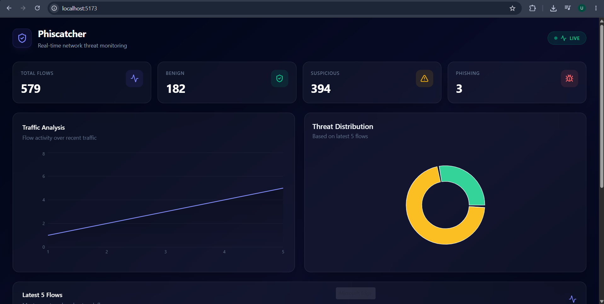
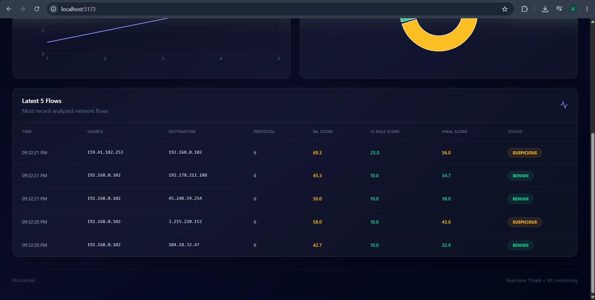

# 📘 Phiscatcher — Phishing Traffic Analysis Using Wireshark

> A real-time network-flow monitoring dashboard that uses TShark, machine learning, and rule-based analysis to identify potentially suspicious or phishing-related traffic.

## Overview

**Phiscatcher** is a local network-flow monitoring application that captures selected packet metadata using **TShark**, processes traffic with **Node.js and Python**, and analyzes each flow using a trained **Random Forest** machine-learning pipeline.

The system extracts **34 traffic and DNS-domain features**, generates a phishing probability, combines the ML result with heuristic rules, and classifies flows as:

- 🟢 **BENIGN**
- 🟡 **SUSPICIOUS**
- 🔴 **PHISHING**

Analyzed flows are stored in **MongoDB** and delivered to a **React dashboard** in real time using **Socket.IO**.

> Phiscatcher provides a statistical risk assessment of observed network flows. A classification should not be treated as proof of malicious activity.

## Architecture

```text
                 Network Interface
                        │
                        ▼
                  ┌───────────┐
                  │  TShark   │
                  └─────┬─────┘
                        │ Packet metadata
                        ▼
                  ┌───────────┐
                  │  Node.js  │
                  │  Backend  │
                  └─────┬─────┘
                        │ JSON Lines
                        ▼
                  ┌───────────┐
                  │  Python   │
                  │ Processor │
                  └─────┬─────┘
                        │
              34 traffic/domain features
                        │
                        ▼
                ┌───────────────┐
                │ Random Forest │
                │    Model      │
                └───────┬───────┘
                        │
                 ML probability
                        │
                        ▼
                ┌───────────────┐
                │ Rule + ML     │
                │   Scoring     │
                └───────┬───────┘
                        │
              BENIGN / SUSPICIOUS /
                    PHISHING
                        │
             ┌──────────┴──────────┐
             ▼                     ▼
        ┌──────────┐          ┌──────────┐
        │ MongoDB  │          │ Socket.IO│
        └──────────┘          └────┬─────┘
                                   │
                                   ▼
                            React Dashboard
```

## Key Features

- 📡 Live packet metadata capture using **TShark**
- 🔄 Bidirectional network-flow aggregation
- 🧠 Machine-learning inference using a **Random Forest** pipeline
- 📊 **34 traffic and DNS-domain features**
- 🛡️ Rule-based threat scoring combined with ML probability
- 🗄️ MongoDB persistence for analyzed flows
- ⚡ Real-time updates through **Socket.IO**
- 📈 Traffic and threat-distribution charts
- 📋 Latest analyzed-flow table
- 🖥️ React-based monitoring dashboard

## Technology Stack

| Layer | Technologies |
|---|---|
| Frontend | React, Vite, Tailwind CSS, Recharts, Axios, Lucide React |
| Backend | Node.js, Express |
| Packet Capture | Wireshark / TShark |
| Data Processing | Python, Pandas |
| Machine Learning | Scikit-learn, Random Forest, Joblib |
| Database | MongoDB, Mongoose |
| Real-Time Communication | Socket.IO |
| Data Exchange | JSON Lines over process stdin/stdout |

## Project Structure

```text
Phiscatcher/
├── backend/
│   ├── controllers/
│   ├── models/
│   ├── routes/
│   ├── services/
│   ├── socket/
│   └── server.js
│
├── frontend/
│   └── src/
│       ├── components/
│       ├── services/
│       ├── App.jsx
│       └── main.jsx
│
├── ml/
│   ├── packet_processor.py
│   ├── train_model.py
│   ├── test_model.py
│   ├── feature_importance.py
│   ├── feature_importance.csv
│   └── phishing_model.pkl
│
├── LICENSE
└── README.md
```

## How It Works

1. **TShark** captures selected packet fields from the configured network interface.
2. **Node.js** parses the captured packet data and forwards it to a persistent Python process.
3. **Python** groups packets into bidirectional flows and calculates 34 features.
4. The saved **Random Forest pipeline** produces a phishing probability.
5. **Node.js** combines the ML probability with heuristic rules using a 70/30 ML-to-rule scoring approach.
6. The completed flow is classified as **BENIGN**, **SUSPICIOUS**, or **PHISHING**.
7. The result is stored in **MongoDB**.
8. **Socket.IO** pushes the new result to the React dashboard.

## Getting Started

### Prerequisites

The application requires:

- Node.js and npm
- Python 3 with the required ML dependencies
- Wireshark / TShark
- MongoDB
- A network interface accessible to TShark
- The provided trained model artifact

### Backend

```powershell
cd backend
npm install express cors dotenv mongoose socket.io
npm install -D nodemon
node server.js
```

The backend expects a MongoDB connection string through:

```text
MONGO_URI
```

The default backend port is **8000**.

### ML

```powershell
cd ml
pip install pandas numpy scikit-learn joblib
```
The AI is ready to run and analyze data

### Frontend

```powershell
cd frontend
npm install react react-dom axios lucide-react recharts socket.io-client tailwindcss @tailwindcss/vite
npm install -D vite@7.3.6 @vitejs/plugin-react@5
npm run dev
```

The frontend is configured to communicate with the local backend.

> The current implementation contains environment-specific capture and API configuration, so TShark installation, interface selection, Python dependencies, and MongoDB connectivity may require adjustment for a different machine.

## Screenshots/Demo

### Main Dashboard



### Latest Flows



## Machine Learning

Phiscatcher uses a saved **scikit-learn Random Forest pipeline** for flow classification.

The live processor calculates 34 features covering:

- Packet counts and byte totals
- Sending and receiving traffic
- Packet-size statistics
- Packet and byte rates
- DNS/domain characteristics
- Character entropy
- Numerical character percentage
- Alphabetic and consonant runs
- Vowel/consonant composition

The trained pipeline performs preprocessing and prediction before returning the phishing probability used by the backend scoring system.

## Detection & Scoring

The final risk score combines:

```text
70% → Machine-learning probability
30% → Rule-based score
```

The resulting score determines the displayed classification:

| Score | Classification |
|---:|---|
| ≥ 75 | 🔴 PHISHING |
| ≥ 40 | 🟡 SUSPICIOUS |
| < 40 | 🟢 BENIGN |

The rule system considers factors including ML probability, selected destination ports, and suspicious keywords in DNS domain names.

## API

| Method | Endpoint | Purpose |
|---|---|---|
| GET | `/api/dashboard/stats` | Dashboard classification statistics |
| GET | `/api/flows/latest-flows` | Latest five analyzed flows |

Socket.IO provides real-time `new-flow` events to connected dashboard clients.

## Limitations

The current implementation is focused on **live network-flow analysis**. It does not currently provide:

- URL-based website scanning
- Browser automation
- Playwright integration
- Scapy-based packet processing
- PCAP file generation
- HTTP/TLS payload inspection
- Threat-intelligence integration
- Automated project test suites

The training datasets are not included in the repository, so model training and evaluation cannot be reproduced from this checkout alone.

## Safety & Authorized Use

Only capture and analyze traffic on systems and networks that you own or are explicitly authorized to inspect.

Network addresses and DNS information can contain sensitive data. Use the application responsibly and in accordance with applicable laws, policies, and organizational requirements.

## Future Scope

Potential improvements include:

- Configurable network-interface and capture settings
- Improved API/environment configuration
- Reproducible model-training datasets and evaluation
- Model calibration and performance analysis
- Expanded threat-intelligence integration
- PCAP export and deeper packet analysis
- Automated testing
- Improved dashboard analytics and historical visualization

## Contributors

| Area | Contributor |
|---|---|
| Frontend Development | [@Shivayan-Tmsl](https://github.com/Shivayan-Tmsl) |
| Backend Development | [@Shivayan-Tmsl](https://github.com/Shivayan-Tmsl) |
| Packet Capture & Analysis | [@Shivayan-Tmsl](https://github.com/Shivayan-Tmsl) |
| Machine Learning | [@Shivayan-Tmsl](https://github.com/Shivayan-Tmsl) |
| Documentation & Testing | [@Shivayan-Tmsl](https://github.com/Shivayan-Tmsl) & [@KALIGHAT-AC](https://github.com/KALIGHAT-AC) |

## License

This project is licensed under the **MIT License**. See [LICENSE](./LICENSE) for details.

---

### Capture the traffic. Analyse the evidence. Catch the phish. 🛡️